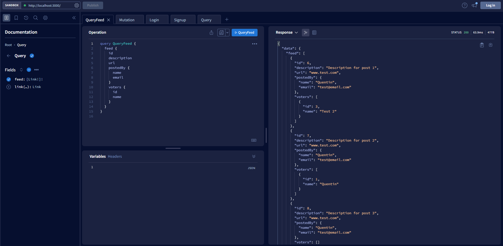
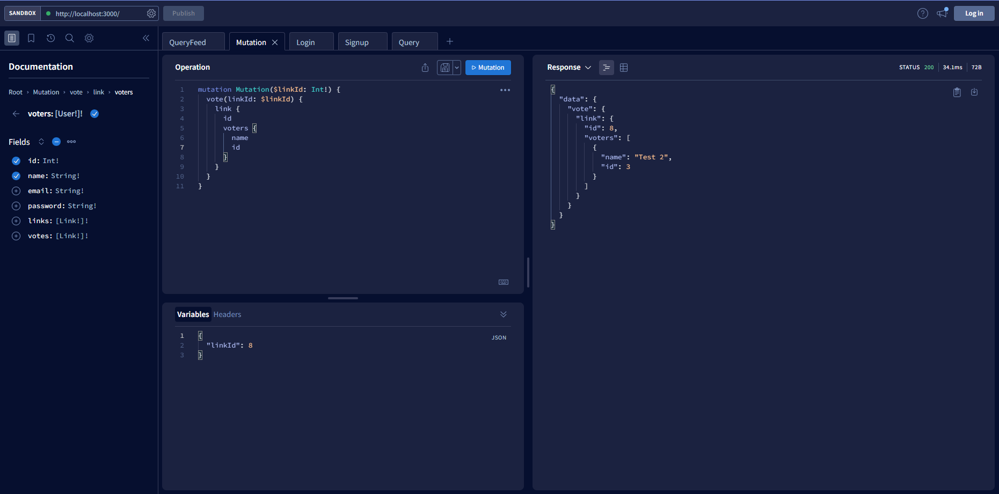

# GraphQL tutorial
Test of GraphQL with Typescript and Apollo 

I followed this tutorial:
https://www.howtographql.com/typescript-apollo/0-introduction/

After downloading the code, do `npm install` to install dependencies. Run with `npm run dev` and go to `http://localhost:3000` to test your GraphQL server

# Query all posts from the databse 

For every post this request get the description, the url, the ID, the author infos, the number of votes, and names of the voters

# Authenticated user upvote a post

Mutation to add a vote to a post. In return, get the post id and the voters infos (name and ID)

